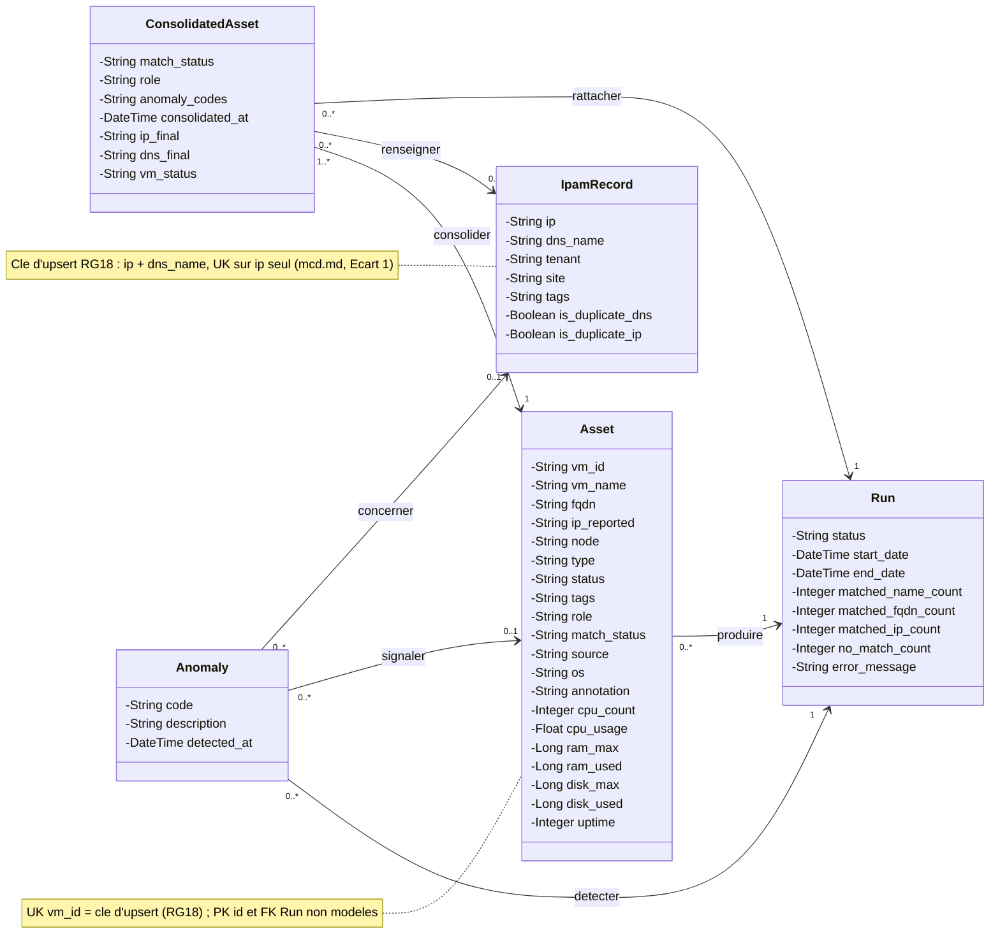

# Classes — CloudInventory v2.0 (UML statique, déduit du MCD/MLD)

Source : `docs/modele/mcd.md` (5 entités, 6 associations), `docs/modele/mld.md` (5 tables, 44 colonnes, 6 FK),
`docs/modele/dictionnaire.md` (44 colonnes typées), `docs/modele/regles.md` (RG01→RG34), `cahier des charges §6.2, §7, §8`.

Règles de passage :
- Une classe par entité MCD, nom PascalCase (`Run`, `Asset`, `IpamRecord`, `ConsolidatedAsset`, `Anomaly`) ; table MLD homonyme.
- Attributs = colonnes du dictionnaire **moins** les 5 PK `id` (identifiant technique non modélisé en UML) et **moins** les 6 FK
  (le lien est porté par la relation, pas par un attribut) : **44 colonnes = 33 attributs + 5 PK + 6 FK**.
- Types UML du dictionnaire : `varchar`/`text` → String, `integer` → Integer, `datetime` → DateTime, `boolean` → Boolean.
- Multiplicités = cardinalités Merise **croisées** : la cardinalité portée par A devient la multiplicité à l'extrémité B ;
  `(1,1)` → `1`, `(0,1)` → `0..1`, `(0,n)` → `0..*`, `(1,n)` → `1..*`.
- Navigabilité `-->` : de la classe qui porte la FK vers la classe référencée (sens de la référence en MLD).
- Méthodes : aucune — `regles.md` ne contient aucune RG [comportement] ; RG01→RG34 sont des règles de données
  exécutées par le pipeline, pas par une méthode de classe (voir Limites Mermaid).

## Diagramme

## Classes

| Classe | Entité MCD | Table MLD | Colonnes MLD | Attributs UML | Nb attributs | Méthodes (RG) | RG |
|--------|------------|-----------|--------------|---------------|--------------|---------------|----|
| Run | Run | run | 9 | status, start_date, end_date, matched_name_count, matched_fqdn_count, matched_ip_count, no_match_count, error_message | 8 | aucune (aucune RG [comportement]) | RG17, RG19, RG20 (statut, dates, compteurs, error_message) |
| Asset | Asset | asset | 22 | vm_id, vm_name, fqdn, ip_reported, node, type, status, tags, role, match_status, source, os, annotation, cpu_count, cpu_usage, ram_max, ram_used, disk_max, disk_used, uptime | 20 | aucune | RG02, RG04→RG08, RG14, RG15, RG16, RG18 (uk vm_id), RG31, RG32, RG37 |
| IpamRecord | IpamRecord | ipam_record | 8 | ip, dns_name, tenant, site, tags, is_duplicate_dns, is_duplicate_ip | 7 | aucune | RG02→RG04, RG06, RG09, RG10, RG12, RG13, RG16, RG18 (clé ip+dns_name), RG33, RG34 |
| ConsolidatedAsset | ConsolidatedAsset | consolidated_asset | 10 | match_status, role, anomaly_codes, consolidated_at, ip_final, dns_final, vm_status | 7 | aucune | RG01→RG05, RG08→RG13, RG15, RG16, RG19, RG24, RG38 |
| Anomaly | Anomaly | anomaly | 7 | code, description, detected_at | 3 | aucune | RG08→RG13, RG17, RG19 |

Justification : chaque classe est une entité du MCD (une-to-one avec sa table MLD) ; les 5 PK `id` et les 6 FK
(`asset.consolidated_run_id`, `consolidated_asset.asset_id/ipam_record_id`, `anomaly.run_id/asset_id/ipam_record_id`)
ne sont pas des attributs : les FK deviennent les 6 relations, les PK restent implicites — d'où 44 = 8+11+7+4+3 (33) + 5 + 6.
Les 12 colonnes de métriques de la VM (9 sur Asset) et d'instantané du run (3 sur ConsolidatedAsset) sont NULL par défaut (RG37, RG38).
Aucune méthode : aucune RG n'exige un comportement porté par une classe (RG01→RG13 matching/anomalies, RG17→RG20 pipeline,
RG24 export, RG18 identifiants d'upsert sont couverts par les attributs et les notes du diagramme).
Aucune classe-association : aucune association du MCD ne porte d'attribut (`mcd.md:88`).

## Relations

Tableau des associations MCD → relations UML ; multiplicités croisées (cardinalité de A → extrémité B).

| Relation UML | Association MCD | Entité A | Card. A (MCD) | Entité B | Card. B (MCD) | Mult. extrémité A (card. B croisée) | Mult. extrémité B (card. A croisée) | Type | FK en MLD | RG |
|--------------|-----------------|----------|---------------|----------|---------------|--------------------------------------|--------------------------------------|------|-----------|----|
| produire | produire | Run | (0,n) | Asset | (1,1) | `1` | `0..*` | association navigable `Asset --> Run` | asset.consolidated_run_id | RG18, RG20, RG31, RG32 |
| detecter | detecter | Run | (0,n) | Anomaly | (1,1) | `1` | `0..*` | association navigable `Anomaly --> Run` | anomaly.run_id | RG17, RG19, RG08→RG13 |
| consolider | consolider | Asset | (1,n) | ConsolidatedAsset | (1,1) | `1` | `1..*` | association navigable `ConsolidatedAsset --> Asset` | consolidated_asset.asset_id | RG01, RG18, RG24 |
| renseigner | renseigner | IpamRecord | (0,n) | ConsolidatedAsset | (0,1) | `0..1` | `0..*` | association navigable `ConsolidatedAsset --> IpamRecord` | consolidated_asset.ipam_record_id | RG04, RG05, RG08, RG18 |
| signaler | signaler | Asset | (0,n) | Anomaly | (0,1) | `0..1` | `0..*` | association navigable `Anomaly --> Asset` | anomaly.asset_id | RG06, RG07, RG10, RG11, RG12, RG13 |
| concerner | concerner | IpamRecord | (0,n) | Anomaly | (0,1) | `0..1` | `0..*` | association navigable `Anomaly --> IpamRecord` | anomaly.ipam_record_id | RG12, RG13, RG08, RG10 |
| rattacher | rattacher | Run | (0,n) | ConsolidatedAsset | (1,1) | `1` | `0..*` | association navigable `ConsolidatedAsset --> Run` | consolidated_asset.run_id | RG35, RG36 |

Contrôle croisé : côté `1` ↔ cardinalité (1,1), côté `0..1` ↔ cardinalité (0,1), côté `0..*` ↔ (0,n), côté `1..*` ↔ (1,n) ;
7 associations MCD → 7 relations UML, aucune relation en moins ni en plus, aucune généralisation (pas d'héritage dans le MCD).

## Limites Mermaid

- **Classe-association** : sans objet — aucune association ne porte d'attribut ; rien à transformer en classe intermédiaire.
- **Rôles d'extrémité** : Mermaid n'exprime pas les rôles nommés (« rattaché à », « référence ») : seul figure le label d'association
  après les guillemets ; le sens est donné par la navigabilité `-->` (côté FK).
- **Contraintes** `{ordered}`, `{xor}`, `{disjoint}` : aucune dans le MCD, rien à noter.
- **Clés candidates** : l'unicité (`vm_id` UK, couple `ip` + `dns_name` UK, clé d'upsert RG18) n'est pas porteable par un membre UML → portée par deux `note`.
- **PK et FK** : `id` non modélisé (convention UML) ; FK remplacées par les relations — d'où 33 attributs pour 44 colonnes.
- **Méthodes** : aucun diagramme UML ne peut deviner une méthode là où `regles.md` n'a pas de RG [comportement] ; les RG01→RG34
  restent traçables via la colonne RG des tableaux ci-dessus.
- **RG21→RG25** (exports fichiers, retentions, authentification, variables) : hors classes, pas de classe inventée (`mcd.md:125-126`).
