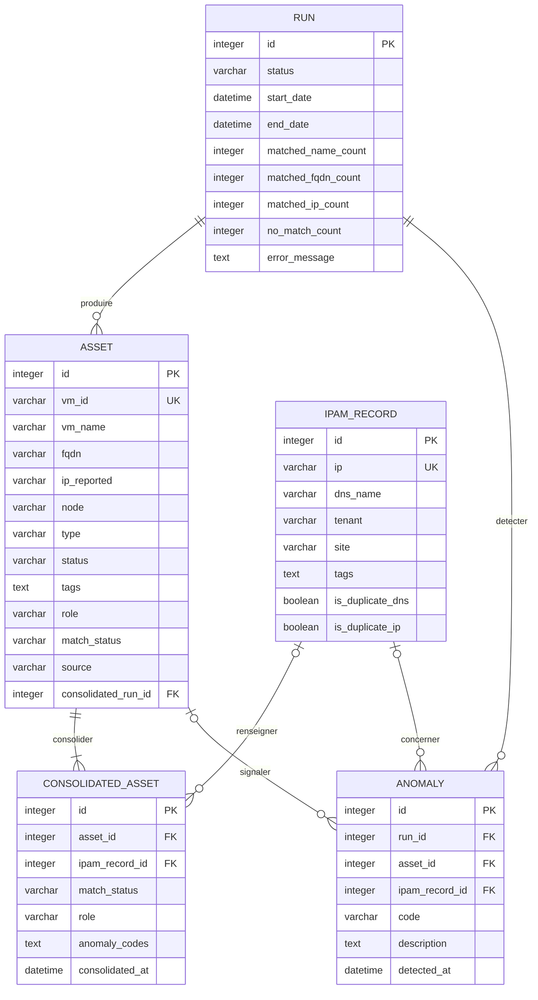

# MCD — CloudInventory v2.0 (Merise)

Source : `.sdv/modele/regles.md` (RG01→RG34), `.sdv/modele/dictionnaire.md` (5 tables / 44 colonnes).
Lecture des cardinalités : le symbole Merise collé à l'entité de gauche traduit la cardinalité portée par
l'entité de droite (double barre = (1,1), barre et cercle = (0,1), accolade = (0,n), accolade barrée = (1,n)).
Exemple Run–Asset : un asset appartient à exactement un run ; un run produit zéro ou plusieurs assets.

## Diagramme

## Entités

| Entité | Identifiant | Attributs (type, longueur, null, clé) |
|--------|-------------|----------------------------------------|
| Run | `id` (PK, auto-increment) | `status` varchar(20) NOT NULL · `start_date` datetime NOT NULL · `end_date` datetime NULL · `matched_name_count` integer NULL · `matched_fqdn_count` integer NULL · `matched_ip_count` integer NULL · `no_match_count` integer NULL · `error_message` text NULL |
| Asset | `id` (PK, auto-increment) | `vm_id` varchar(50) UNIQUE NOT NULL · `vm_name` varchar(100) NOT NULL · `fqdn` varchar(200) NULL · `ip_reported` varchar(45) NULL · `node` varchar(10) NULL · `type` varchar(10) NULL · `status` varchar(20) NULL · `tags` text NULL · `role` varchar(50) NULL · `match_status` varchar(20) NULL · `source` varchar(10) NULL · `consolidated_run_id` integer NOT NULL FK → Run |
| IpamRecord | `id` (PK, auto-increment) | `ip` varchar(45) UNIQUE NOT NULL · `dns_name` varchar(200) NOT NULL · `tenant` varchar(50) NULL · `site` varchar(50) NULL · `tags` text NULL · `is_duplicate_dns` boolean NULL default FALSE · `is_duplicate_ip` boolean NULL default FALSE |
| ConsolidatedAsset | `id` (PK, auto-increment) | `asset_id` integer NOT NULL FK → Asset · `ipam_record_id` integer NULL FK → IpamRecord · `match_status` varchar(20) NOT NULL · `role` varchar(50) NULL · `anomaly_codes` text NULL · `consolidated_at` datetime NULL |
| Anomaly | `id` (PK, auto-increment) | `run_id` integer NOT NULL FK → Run · `asset_id` integer NULL FK → Asset · `ipam_record_id` integer NULL FK → IpamRecord · `code` varchar(20) NOT NULL · `description` text NULL · `detected_at` datetime NOT NULL |

## Associations

Cardinalités au format (min,max) ; « card. A » = participation d'une occurrence de A à l'association.
Aucune association ne porte d'attribut : toutes les données du dictionnaire sont portées par une entité.

| Nom | Entité A | Card. A | Entité B | Card. B | Attributs portés | RG |
|------|----------|---------|----------|---------|------------------|----|
| produire | Run | (0,n) | Asset | (1,1) | aucun | RG18 (upsert des Asset dans le run), RG20 (rollback : un run échoué n'a aucun asset persistant), RG31, RG32 (collecte des assets du run) |
| detecter | Run | (0,n) | Anomaly | (1,1) | aucun | RG17, RG19 (run support des anomalies et des compteurs), RG08→RG13 (codes conditionnels : 0 anomalie possible) |
| consolider | Asset | (1,n) | ConsolidatedAsset | (1,1) | aucun | RG01 (chaque exécution applique le matching 4 niveaux), RG18 (un asset persiste et re-consolide à chaque run), RG24 (champs consolidés) |
| renseigner | IpamRecord | (0,n) | ConsolidatedAsset | (0,1) | aucun | RG04, RG05, RG08 (NO_MATCH : `ipam_record_id` NULL), RG18 (upsert des IpamRecord) |
| signaler | Asset | (0,n) | Anomaly | (0,1) | aucun | RG06, RG07, RG10, RG11 (anomalies portées par un asset), RG12, RG13 (`asset_id` NULL pour les doublons IPAM purs) |
| concerner | IpamRecord | (0,n) | Anomaly | (0,1) | aucun | RG12, RG13 (DUPLICATE_DNS / DUPLICATE_IP portés par un enregistrement), RG08, RG10 (\`ipam_record_id\` NULL pour les anomalies de VM) |

Lecture en langage :
- produire — un asset appartient à exactement un run ; un run produit zéro ou plusieurs assets.
- detecter — une anomalie est rattachée à exactement un run ; un run détecte zéro ou plusieurs anomalies.
- consolider — un asset consolidé référence exactement un asset ; un asset est consolidé une ou plusieurs fois.
- renseigner — un asset consolidé référence au plus un enregistrement IPAM (aucun si NO_MATCH) ; un enregistrement IPAM est référencé par zéro ou plusieurs assets consolidés.
- signaler — une anomalie référence au plus un asset ; un asset soulève zéro ou plusieurs anomalies.
- concerner — une anomalie référence au plus un enregistrement IPAM ; un enregistrement IPAM concerne zéro ou plusieurs anomalies.

## Traçabilité

| Élément | Nature | RG |
|---------|--------|----|
| produire, detecter | association | RG17, RG18, RG19, RG20, RG31, RG32, RG08→RG13 |
| consolider, renseigner | association | RG01, RG02, RG03, RG04, RG05, RG08, RG18, RG24 |
| signaler, concerner | association | RG06, RG07, RG10, RG11, RG12, RG13 |
| Run, status, start_date, end_date, compteurs, error_message | entité + attributs | RG17, RG19, RG20 |
| Asset.vm_id (UK), IpamRecord.ip (UK) | clé candidate d'upsert | RG18 |
| Asset.vm_name, Asset.fqdn, IpamRecord.dns_name, Asset.match_status, ConsolidatedAsset.match_status | attributs | RG02, RG03, RG04, RG05, RG14 (normalisation appliquée à ces colonnes) |
| Asset.tags, Asset.role, ConsolidatedAsset.role | attributs | RG15, RG16 |
| ConsolidatedAsset (ensemble), anomaly_codes, consolidated_at | entité + attributs | RG08→RG13, RG24 |
| IpamRecord.is_duplicate_dns, IpamRecord.is_duplicate_ip | attributs | RG12, RG13 |
| IpamRecord.tenant | attribut | RG33 (structure) |
| IpamRecord.site | attribut | RG34 (structure) |
| Asset.node | attribut | RG31 (structure) |
| Asset.type | attribut | RG32 (structure) |
| Anomaly.code, Anomaly.description, Anomaly.detected_at | attributs | RG08→RG13, RG19 |
| RG21, RG22, RG23 | hors MCD (exports fichiers, retentions) | — voir Écarts |
| RG25→RG30 | hors MCD (authentification, variables d'environnement) | — voir Écarts |

## Écarts et questions

1. **Clé d'upsert IpamRecord** — RG18 impose l'upsert par `ip + dns_name` alors que le dictionnaire marque `ip` UNIQUE seul : clé candidate retenue = `ip` (UK), `dns_name` conservé comme attribut de l'upsert. Non tranché plus loin, faute de RG dédiée.
2. **FK du dictionnaire** — `Asset.consolidated_run_id`, `ConsolidatedAsset.asset_id/ipam_record_id`, `Anomaly.run_id/asset_id/ipam_record_id` sont figurés `FK` au diagramme par fidélité au dictionnaire ; en MCD ils sont portés par les associations (passage en colonnes au stade MLD).
3. **Lien Run → ConsolidatedAsset** — absent du dictionnaire : le rattachement au run est transitif via `Asset.consolidated_run_id`. La copie de référence (`reference/CloudInventory.v2/app/models.py`) porte un `run_id` direct sur `ConsolidatedAsset` : écart signalé, non modélisé (aucune RG ne l'impose).
4. **Matching Asset ↔ IpamRecord** — pas d'association directe : la correspondance est portée par `ConsolidatedAsset` (`match_status`, `asset_id`, `ipam_record_id`), ce qui couvre RG01→RG05.
5. **Anomaly.asset_id nullable** — le dictionnaire l'autorise NULL (RG12, RG13), la copie de référence le déclare NOT NULL : le dictionnaire fait foi.
6. **RG21→RG23 (exports, retentions)** et **RG25→RG30 (authentification, variables sensibles)** : objets fichiers ou paramétrage, sans existence propre identifiée — hors périmètre du MCD.
7. **RG24** : les champs listés (vm_id, métriques, ip_final, dns_final…) sont répartis entre `Asset`, `ConsolidatedAsset` et `IpamRecord` ; l'export JSONL.gz n'est pas une entité.
8. **Questions ouvertes** : `regles.md` n'en comporte aucune ; aucune RG n'a été inventée.
