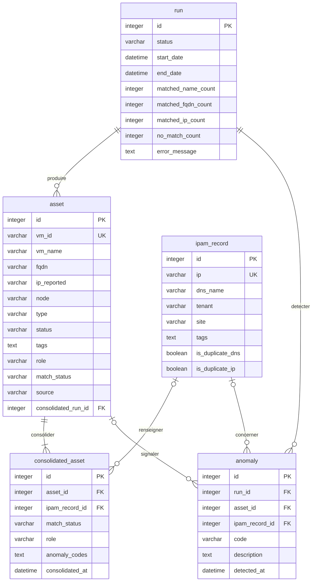

# MLD — CloudInventory v2.0 (Merise, niveau logique)

Source : `docs/modele/mcd.md` (5 entités, 6 associations), `docs/modele/dictionnaire.md` (5 tables / 44 colonnes), `docs/modele/regles.md` (RG01→RG34), `cahier des charges` §6.2, §7, §8.
Règle de passage : PK du côté (x,1), FK dans la table du côté (x,1) de l'association ; aucune colonne hors dictionnaire.
Types SQL = type + longueur du dictionnaire (`integer`→INT, `varchar`→VARCHAR(n), `datetime`→DATETIME, `text`→TEXT, `boolean`→BOOLEAN) ;
le diagramme porte le type atomique du dictionnaire, les longueurs figurent dans les tableaux.

## Diagramme

## Tables

### run

| colonne | type | null | défaut | contrainte |
|---------|------|------|--------|------------|
| id | INT AUTO_INCREMENT | NOT NULL | — | PK |
| status | VARCHAR(20) | NOT NULL | — | CHECK IN ('RUNNING','SUCCESS','FAIL') |
| start_date | DATETIME | NOT NULL | — | |
| end_date | DATETIME | NULL | — | |
| matched_name_count | INT | NULL | — | |
| matched_fqdn_count | INT | NULL | — | |
| matched_ip_count | INT | NULL | — | |
| no_match_count | INT | NULL | — | |
| error_message | TEXT | NULL | — | |

- PK : id
- FK : aucune
- Index : idx_run_status (status), idx_run_start_date (start_date)
- Origine : entité Run — RG17, RG19 (compteurs), RG20 (status FAIL + error_message)

### asset

| colonne | type | null | défaut | contrainte |
|---------|------|------|--------|------------|
| id | INT AUTO_INCREMENT | NOT NULL | — | PK |
| vm_id | VARCHAR(50) | NOT NULL | — | UNIQUE (clé d'upsert, RG18) |
| vm_name | VARCHAR(100) | NOT NULL | — | |
| fqdn | VARCHAR(200) | NULL | — | |
| ip_reported | VARCHAR(45) | NULL | — | |
| node | VARCHAR(10) | NULL | — | CHECK IN ('pve1','pve2','pve3','pve4','pve5') |
| type | VARCHAR(10) | NULL | — | CHECK IN ('qemu','lxc') |
| status | VARCHAR(20) | NULL | — | CHECK IN ('running','stopped') |
| tags | TEXT | NULL | — | |
| role | VARCHAR(50) | NULL | — | |
| match_status | VARCHAR(20) | NULL | — | CHECK IN ('MATCHED_NAME','MATCHED_FQDN','MATCHED_IP','NO_MATCH') |
| source | VARCHAR(10) | NULL | — | CHECK IN ('VIRT','IPAM') |
| consolidated_run_id | INT | NOT NULL | — | FK → run(id) |

- PK : id
- FK : consolidated_run_id → run(id) ON DELETE RESTRICT
- Index : uk_asset_vm_id UNIQUE (vm_id), idx_asset_consolidated_run_id (consolidated_run_id), idx_asset_vm_name (vm_name), idx_asset_fqdn (fqdn), idx_asset_ip_reported (ip_reported), idx_asset_status (status), idx_asset_node (node), idx_asset_type (type), idx_asset_match_status (match_status)
- Origine : entité Asset + association produire — RG02, RG04→RG08, RG15, RG16, RG18, RG31, RG32

### ipam_record

| colonne | type | null | défaut | contrainte |
|---------|------|------|--------|------------|
| id | INT AUTO_INCREMENT | NOT NULL | — | PK |
| ip | VARCHAR(45) | NOT NULL | — | UNIQUE |
| dns_name | VARCHAR(200) | NOT NULL | — | |
| tenant | VARCHAR(50) | NULL | — | |
| site | VARCHAR(50) | NULL | — | |
| tags | TEXT | NULL | — | |
| is_duplicate_dns | BOOLEAN | NULL | FALSE | |
| is_duplicate_ip | BOOLEAN | NULL | FALSE | |

- PK : id
- FK : aucune
- Index : uk_ipam_record_ip UNIQUE (ip), idx_ipam_record_dns_name (dns_name)
- Origine : entité IpamRecord — RG02, RG03, RG04, RG06, RG09, RG10, RG12, RG13, RG16, RG18, RG33, RG34

### consolidated_asset

| colonne | type | null | défaut | contrainte |
|---------|------|------|--------|------------|
| id | INT AUTO_INCREMENT | NOT NULL | — | PK |
| asset_id | INT | NOT NULL | — | FK → asset(id) |
| ipam_record_id | INT | NULL | — | FK → ipam_record(id) (NULL si NO_MATCH) |
| match_status | VARCHAR(20) | NOT NULL | — | CHECK IN ('MATCHED_NAME','MATCHED_FQDN','MATCHED_IP','NO_MATCH') |
| role | VARCHAR(50) | NULL | — | |
| anomaly_codes | TEXT | NULL | — | |
| consolidated_at | DATETIME | NULL | — | |

- PK : id
- FK : asset_id → asset(id) ON DELETE CASCADE
- FK : ipam_record_id → ipam_record(id) ON DELETE RESTRICT
- Index : idx_consolidated_asset_asset_id (asset_id), idx_consolidated_asset_ipam_record_id (ipam_record_id), idx_consolidated_asset_match_status (match_status)
- Origine : entité ConsolidatedAsset + associations consolider, renseigner — RG01→RG05, RG08→RG13, RG15, RG16, RG18, RG19, RG24

### anomaly

| colonne | type | null | défaut | contrainte |
|---------|------|------|--------|------------|
| id | INT AUTO_INCREMENT | NOT NULL | — | PK |
| run_id | INT | NOT NULL | — | FK → run(id) |
| asset_id | INT | NULL | — | FK → asset(id) |
| ipam_record_id | INT | NULL | — | FK → ipam_record(id) |
| code | VARCHAR(20) | NOT NULL | — | CHECK IN ('NO_MATCH','HOSTNAME_MISMATCH','STATUS_MISMATCH','DUPLICATE_DNS','DUPLICATE_IP') |
| description | TEXT | NULL | — | |
| detected_at | DATETIME | NOT NULL | — | |

- PK : id
- FK : run_id → run(id) ON DELETE RESTRICT
- FK : asset_id → asset(id) ON DELETE RESTRICT
- FK : ipam_record_id → ipam_record(id) ON DELETE RESTRICT
- Index : idx_anomaly_run_id (run_id), idx_anomaly_asset_id (asset_id), idx_anomaly_ipam_record_id (ipam_record_id), idx_anomaly_code (code)
- Origine : entité Anomaly + associations detecter, signaler, concerner — RG06→RG13, RG17, RG19

## Tableau MLD

44 colonnes, telles que le dictionnaire (noms et types identiques).

| Table | Colonne | Type | PK/FK | Table référencée | RG |
|-------|---------|------|-------|------------------|----|
| run | id | INT AUTO_INCREMENT | PK | — | RG17, RG19 |
| run | status | VARCHAR(20) | | — | RG17, RG19, RG20 |
| run | start_date | DATETIME | | — | RG17 |
| run | end_date | DATETIME | | — | RG19 |
| run | matched_name_count | INT | | — | RG19 |
| run | matched_fqdn_count | INT | | — | RG19 |
| run | matched_ip_count | INT | | — | RG19 |
| run | no_match_count | INT | | — | RG19 |
| run | error_message | TEXT | | — | RG20 |
| asset | id | INT AUTO_INCREMENT | PK | — | RG18 |
| asset | vm_id | VARCHAR(50) | UK | — | RG18 |
| asset | vm_name | VARCHAR(100) | | — | RG02, RG15 |
| asset | fqdn | VARCHAR(200) | | — | RG02 |
| asset | ip_reported | VARCHAR(45) | | — | RG04, RG06 |
| asset | node | VARCHAR(10) | | — | RG31 |
| asset | type | VARCHAR(10) | | — | RG32 |
| asset | status | VARCHAR(20) | | — | RG07 |
| asset | tags | TEXT | | — | RG16 |
| asset | role | VARCHAR(50) | | — | RG15, RG16 |
| asset | match_status | VARCHAR(20) | | — | RG05-RG08 |
| asset | source | VARCHAR(10) | | — | RG04 |
| asset | consolidated_run_id | INT | FK | run(id) | RG18 |
| ipam_record | id | INT AUTO_INCREMENT | PK | — | RG18 |
| ipam_record | ip | VARCHAR(45) | UK | — | RG04, RG06, RG09, RG13 |
| ipam_record | dns_name | VARCHAR(200) | | — | RG02, RG03, RG10, RG12 |
| ipam_record | tenant | VARCHAR(50) | | — | RG33 |
| ipam_record | site | VARCHAR(50) | | — | RG34 |
| ipam_record | tags | TEXT | | — | RG16 |
| ipam_record | is_duplicate_dns | BOOLEAN | | — | RG12 |
| ipam_record | is_duplicate_ip | BOOLEAN | | — | RG13 |
| consolidated_asset | id | INT AUTO_INCREMENT | PK | — | RG18 |
| consolidated_asset | asset_id | INT | FK | asset(id) | RG18 |
| consolidated_asset | ipam_record_id | INT | FK | ipam_record(id) | RG18 |
| consolidated_asset | match_status | VARCHAR(20) | | — | RG05-RG08 |
| consolidated_asset | role | VARCHAR(50) | | — | RG15, RG16 |
| consolidated_asset | anomaly_codes | TEXT | | — | RG08-RG13 |
| consolidated_asset | consolidated_at | DATETIME | | — | RG19 |
| anomaly | id | INT AUTO_INCREMENT | PK | — | RG08 |
| anomaly | run_id | INT | FK | run(id) | RG17, RG19 |
| anomaly | asset_id | INT | FK | asset(id) | RG06, RG07, RG11 |
| anomaly | ipam_record_id | INT | FK | ipam_record(id) | RG12, RG13 |
| anomaly | code | VARCHAR(20) | | — | RG08-RG13 |
| anomaly | description | TEXT | | — | RG08 |
| anomaly | detected_at | DATETIME | | — | RG19 |

## Notes de clés étrangères (cardinalité MCD d'origine)

1. **asset.consolidated_run_id → run(id)** — association *produire*, Run (0,n) – Asset (1,1) : le côté max = 1 est Asset,
   la FK s'y place ; NOT NULL car min = 1 (chaque asset appartient à exactement un run, RG18/RG20).
2. **anomaly.run_id → run(id)** — association *detecter*, Run (0,n) – Anomaly (1,1) : FK côté Anomaly (max = 1) ;
   NOT NULL car min = 1 (une anomalie est rattachée à exactement un run, RG17/RG19).
3. **consolidated_asset.asset_id → asset(id)** — association *consolider*, Asset (1,n) – ConsolidatedAsset (1,1) :
   FK côté ConsolidatedAsset (max = 1) ; NOT NULL car min = 1 (un asset consolidé référence exactement un asset).
4. **consolidated_asset.ipam_record_id → ipam_record(id)** — association *renseigner*, IpamRecord (0,n) – ConsolidatedAsset (0,1) :
   FK côté ConsolidatedAsset (max = 1) ; NULL car min = 0 (aucun enregistrement IPAM si NO_MATCH, RG05/RG08).
5. **anomaly.asset_id → asset(id)** — association *signaler*, Asset (0,n) – Anomaly (0,1) : FK côté Anomaly (max = 1) ;
   NULL car min = 0 (doublons IPAM purs sans asset, RG12/RG13 ; le dictionnaire fait foi — voir Écart 5 de mcd.md).
6. **anomaly.ipam_record_id → ipam_record(id)** — association *concerner*, IpamRecord (0,n) – Anomaly (0,1) :
   FK côté Anomaly (max = 1) ; NULL car min = 0 (anomalies de VM sans enregistrement IPAM, RG08/RG10).

Aucune association (x,n)-(x,n) ni n-aire : 6 associations → 6 FK, 0 table de jointure.
Aucune association ne porte d'attribut : aucun attribut déplacé au passage MCD → MLD.

## Décisions

- **Héritage** : absent du MCD → pas de table mère/fille, pas de discriminant ; 5 tables = 5 entités, 44 colonnes.
- **Fusions** : aucune association (1,1)-(1,1) → aucune fusion ; chaque entité garde sa table.
- **1FN** : une valeur par colonne ; `tags` et `anomaly_codes` sont des TEXT JSON prévus tels quels par le dictionnaire (RG16, RG08→RG13), pas des listes concaténées.
- **2FN / 3FN** : PK simples partout, aucune colonne dépendante d'une partie de clé ni d'une colonne non-clé ; aucun écart, aucune colonne calculée (pas de `total_ttc` équivalent).
- **Énumérations** : VARCHAR conservé (types alignés sur le dictionnaire) ; CHECK dérivés des descriptions du dictionnaire et du tableau §6.2 (codes d'anomalie figés par RG08→RG13). Pas d'ENUM ni de table de référence : le dictionnaire n'en porte aucune.
- **ON DELETE** : RESTRICT par défaut ; CASCADE uniquement pour `consolidated_asset.asset_id` (lignes dérivées d'un asset, RG18 : l'asset persiste et se re-consolide à chaque run) ; SET NULL écarté pour les FK NULLables (un `asset_id`/`ipam_record_id` remis à NULL détruirait la preuve de l'anomalie).
- **Index de recherche** : colonnes citées par les cas d'utilisation — §8.3/§9.4 (q sur vm_name, fqdn, ip_reported, dns_name ; filtres status, node, type, match), §8.8 (filtre code), §8.4 (liste des runs par date et statut).

### Écarts documentés (de mcd.md, non tranchés ici)

1. **Clé d'upsert IpamRecord** — RG18 impose `ip + dns_name`, le dictionnaire marque `ip` UNIQUE seul : le MLD retient
   UNIQUE(ip) ; un index composite `(ip, dns_name)` reste optionnel, faute de RG tranchant la question (mcd.md, Écart 1).
2. **FK du dictionnaire** — `consolidated_run_id`, `asset_id`, `ipam_record_id`, `run_id` étaient portés par les associations
   du MCD et deviennent des colonnes FK au stade MLD, sans changement de nom ni de type (mcd.md, Écart 2).
3. **Lien run → consolidated_asset** — absent du dictionnaire : le rattachement au run reste transitif via `asset.consolidated_run_id` ;
   aucune colonne ajoutée (mcd.md, Écart 3).
4. **Matching Asset ↔ IpamRecord** — pas d'association directe ni de table de jointure : porté par `consolidated_asset` (mcd.md, Écart 4).
5. **anomaly.asset_id NULLABLE** — le dictionnaire fait foi contre la copie de référence NOT NULL (mcd.md, Écart 5).
6. **RG24** — champs d'export (os, métriques CPU/RAM/disque, ip_final, dns_final) absents du dictionnaire : aucune colonne inventée,
   l'export JSONL.gz n'est pas une table (mcd.md, Écart 7).
7. **RG21→RG23, RG25→RG30** — exports, retentions, authentification, variables : hors MLD (mcd.md, Écart 6).

### RG couvertes

RG01→RG20 et RG31→RG34 intégralement par les 5 tables et leurs contraintes ; RG24 partiellement (colonnes d'export réparties
entre `asset`, `ipam_record`, `consolidated_asset`) ; RG21→RG23 et RG25→RG30 hors MLD (voir ci-dessus).

## Ordre de création

1. `run` (aucune FK)
2. `ipam_record` (aucune FK)
3. `asset` (FK → `run`)
4. `consolidated_asset` (FK → `asset`, `ipam_record`)
5. `anomaly` (FK → `run`, `asset`, `ipam_record`)
