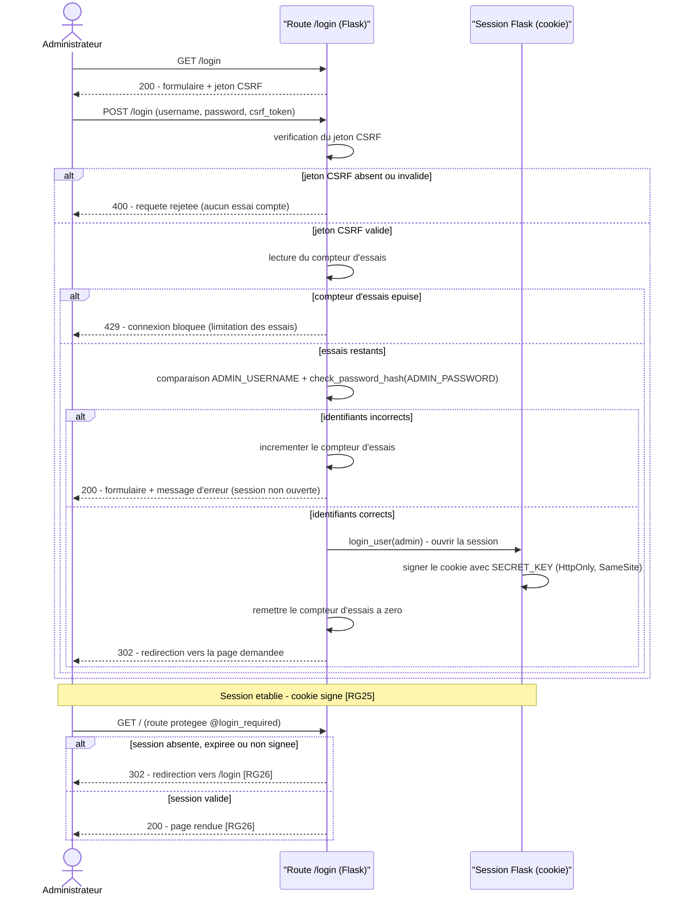
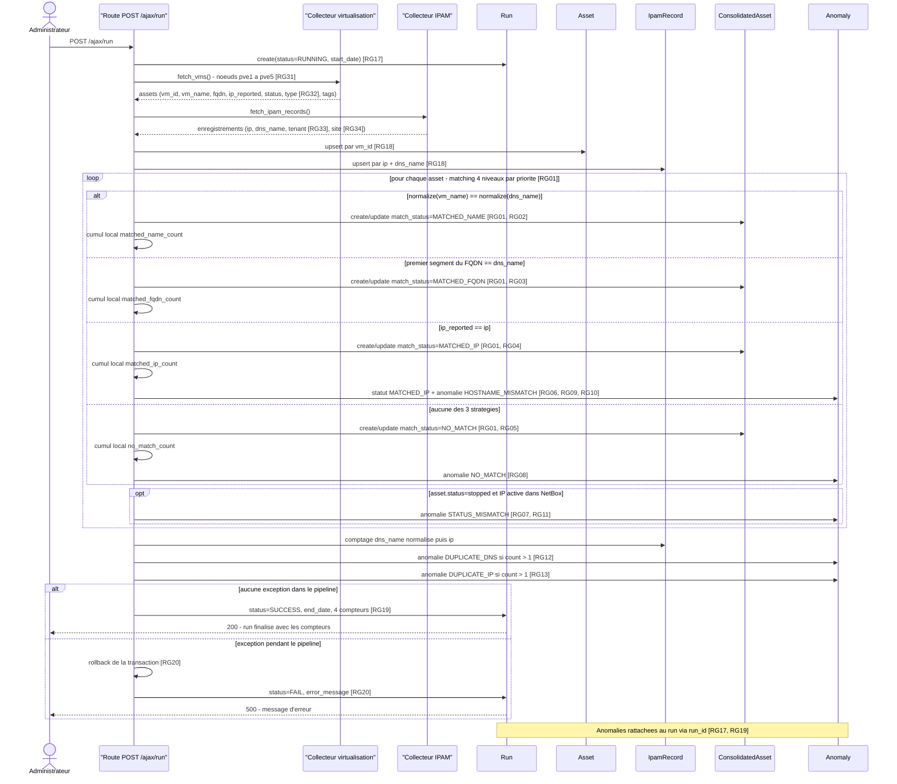

# Diagrammes de séquence — CloudInventory v2.0

Deux scénarios nominaux, un par cas ; les variantes sont dans des fragments `alt` / `opt`.
Entrées : `regles.md` (RG), `classes.md` (participants), `cahier des charges` §6, §7, §8, §10, §13.

---

## (a) Authentification web — soumission du login

**Légende.** Acteur : `Administrateur` — compte unique `ADMIN_USERNAME` + mot de passe haché `ADMIN_PASSWORD` (§10.1, §10.3).
Participants : `Route /login (Flask)` et `Session Flask (cookie)` — **composants**, aucune classe de `classes.md` ne porte l'authentification.
Entrées : `GET /login`, `POST /login` (`username`, `password`, `csrf_token`). Sorties : `400` (CSRF invalide), `429` (essais épuisés),
`200` (formulaire + message d'erreur), `302` (session créée ou redirection vers `/login`), `200` (route protégée rendue).
Formes Mermaid : `->>` appel synchrone, `-->>` retour, `alt/else/end` choix (imbriqués), `Note over` remarque.
RG citées : **RG25** (session signée par `SECRET_KEY`), **RG26** (toutes les routes web sous `@login_required`).
Jeton CSRF et limitation des essais : contraintes du SDV (`cahier des charges`, « Sécurité ») — **sans numéro de RG**,
`regles.md` ne contenant aucune RG pour ces deux mesures.

### Diagramme

### Traçabilité

| Élément du diagramme | RG / source |
|---|---|
| Création de session signée avec `SECRET_KEY` | RG25 |
| Routes rendues ou redirigées selon la session (`@login_required`) | RG26 |
| Vérification du jeton CSRF | Contraintes SDV, `cahier des charges` « Sécurité » (aucune RG) |
| Limitation des essais de connexion | Contraintes SDV, `cahier des charges` « Sécurité » (aucune RG) |
| Comparaison `ADMIN_USERNAME` / `ADMIN_PASSWORD` haché | `cahier des charges` §10.1, §10.3 |
| Participants (route, session) | Composants Flask/Flask-Login, `cahier des charges` §5.2, §10.1 — hors `classes.md` |

### Non représenté

- Authentification API JWT (RG27, RG28) et routes `@jwt_required()` : hors périmètre (§10.2).
- Refus de démarrage sur secrets absents ou par défaut (RG29, RG30) : préalable au lancement, pas un message de séquence.
- `next` non sûr (open redirect), en-têtes de sécurité, `127.0.0.1` : contraintes SDV non figurables comme message ici.
- Compteur d'essais et jeton CSRF n'ont aucune entité dans `classes.md` : représentés en auto-appels sur la route.

---

## (b) Cycle d'inventaire — collecte, consolidation, anomalies, finalisation

**Légende.** Acteur : `Administrateur` (déclenche `POST /run` ou `POST /ajax/run`, §8.2).
Participants-classes (`classes.md`) : `Run`, `Asset`, `IpamRecord`, `ConsolidatedAsset`, `Anomaly`.
Participants-composants : `Collecteur virtualisation` (Proxmox/mock), `Collecteur IPAM` (NetBox/mock), `Route POST /ajax/run`.
Entrées : VM/CT des 5 noeuds + enregistrements IPAM. Sorties : lignes `run` (statut, dates, 4 compteurs),
`asset`, `ipam_record`, `consolidated_asset`, `anomaly` ; réponse 200 ou 500 à l'acteur.
Formes Mermaid : `->>` appel synchrone, `-->>` retour, `loop/end` répétition, `alt/else/end` choix, `opt/end` optionnel, `Note over`.
RG citées : **RG01** (ordre des 4 niveaux), **RG02→RG05** (stratégies), **RG06→RG13** (anomalies),
**RG17, RG19, RG20** (statuts et compteurs du run), **RG18** (clés d'upsert), **RG31→RG34** (collecte, type, tenant, site).

### Diagramme

### Traçabilité

| Élément du diagramme | RG / source |
|---|---|
| `create(status=RUNNING, start_date)` | RG17 |
| Ordre des 4 niveaux dans le `loop` (NAME → FQDN → IP → NO_MATCH) | RG01 |
| `MATCHED_NAME` / hostname normalisé | RG02 |
| `MATCHED_FQDN` / premier segment du FQDN | RG03 |
| `MATCHED_IP` / `ip_reported == ip` | RG04 |
| `NO_MATCH` en dernier recours | RG05, RG08 |
| `statut MATCHED_IP` + `anomalie HOSTNAME_MISMATCH` | RG06, RG09, RG10 |
| `STATUS_MISMATCH` (`stopped` + IP active) | RG07, RG11 |
| `DUPLICATE_DNS` / `DUPLICATE_IP` | RG12, RG13 |
| Upserts `vm_id` et `ip + dns_name` | RG18 |
| `status=SUCCESS`, `end_date`, `matched_name_count`, `matched_fqdn_count`, `matched_ip_count`, `no_match_count` | RG19 |
| `rollback`, `status=FAIL`, `error_message` | RG20 |
| Collecte de tous les noeuds, `type`, `tenant`, `site` | RG31, RG32, RG33, RG34 |
| Anomalies attendues (3 NO_MATCH, 1 statut MATCHED_IP + anomalie HOSTNAME_MISMATCH, 2 STATUS_MISMATCH, 1 DUPLICATE_DNS, 1 DUPLICATE_IP) | `cahier des charges` §13.3 |

### Non représenté

- Les 7 étapes du pipeline (§8.2) sont séquencées mais pas détaillées en sous-messages (index DNS/IP, pagination).
- Déduction du rôle (RG15, RG16) et normalisation (RG14) : inclus dans les messages de matching, non dépliés.
- Exports et retentions (RG21→RG24), notifications (§8.9), comparaison de runs (§8.6) : hors périmètre.
- Le cumul des compteurs est montré en auto-appel local : `RG19` impose l'écriture à la finalisation, pas pendant la boucle.
- Collecteurs réels Proxmox/NetBox : seules les sources simulées sont exécutées (contraintes SDV).
